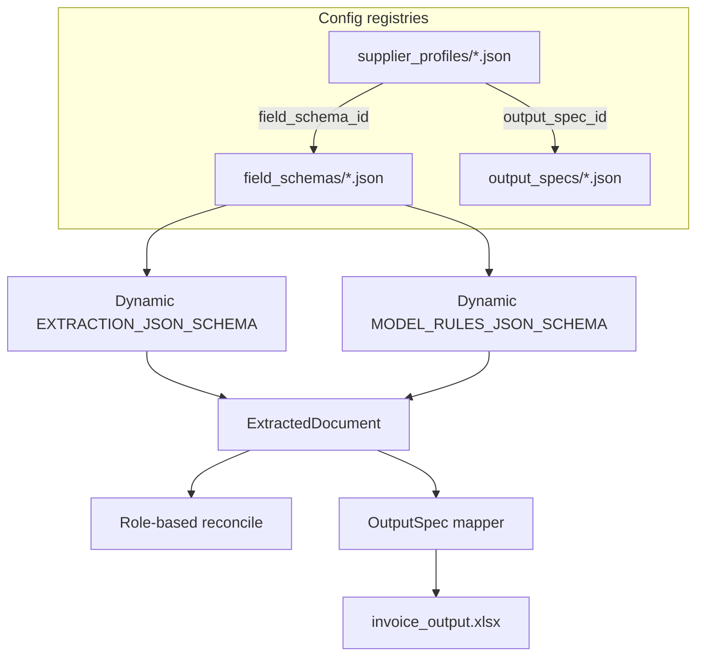

# Schema-driven extraction — implementation plan

> User-defined fields for any document. Replace the hardcoded invoice-centric extraction
> contract with a FieldSchema registry and generic `ExtractedDocument` record, while
> preserving invoice behavior via a shipped `invoice.standard` template and unchanged
> TemForce/corpus golden outputs.

## Context

The previous pass made the OUTPUT configurable (`OutputSpec`) and slimmed the supplier
profile, but the EXTRACTION schema is still hardcoded to "this document is an invoice."
`CanonicalInvoice` has fixed fields, the AI extraction uses one static
`EXTRACTION_JSON_SCHEMA`, the deterministic model keys fields off fixed enums, and the
profile's "Header Label Mapping" only lets the user pick the *label* for a pre-decided
invoice field. A non-invoice PDF (purchase order, lab report, shipping manifest) has
nowhere to go.

**Goal:** the user declares **what fields to extract** — document-level and row-level —
and the whole pipeline (AI extraction, deterministic model, reconciliation, output)
operates over those user-defined fields. Invoice becomes one schema template among many.

### Decisions (locked)

- **Full generic-record replacement:** replace `CanonicalInvoice` with a generic
  `ExtractedDocument`; invoice is just a template.
- **Invoice default behavior-preserving:** ship a built-in `invoice.standard` field schema
  that reproduces today's extraction/output EXACTLY so the June 30 pilot path is
  unaffected. The corpus golden outputs are the safety rail — they must not change.
- **Shared registry:** field schemas live in `field_schemas/*.json` (mirrors
  `output_specs/`); a profile references one by id and may override.
- **Build now**, behind the unchanged invoice default.

### Reuse (don't rebuild)

- `specs/loader.py` + `output/spec.py` — exact pattern for the field-schema
  registry/loader, and `OutputSpec` already maps columns from string paths.
- Dynamic JSON-schema construction already exists: `MODEL_RULES_JSON_SCHEMA` is built
  programmatically in `models/authoring.py`, and the classifier builds a strict schema
  inline — reuse this to build the extraction schema per FieldSchema.
- `validation/reconciler.py reconcile()` — generalize, don't replace.
- `ExtractionModel.header_fields/item_fields/totals` (`models/schema.py`) are already
  name-keyed dicts/lists — the work is removing the fixed enums, not restructuring.

---

## Current state (validated)

The pipeline already has a **configurable delivery layer** (`OutputSpec` +
[`specs/loader.py`](../src/stencil/specs/loader.py)) but a **fixed extraction contract**:

| Layer | Location | Static today |
|-------|----------|--------------|
| AI schema | [`extraction/extractor.py`](../src/stencil/extraction/extractor.py) `EXTRACTION_JSON_SCHEMA` | Fixed header / line_items / totals properties |
| Canonical record | [`validation/schema.py`](../src/stencil/validation/schema.py) `CanonicalInvoice` | ~31 consuming files |
| Reconciliation | [`validation/reconciler.py`](../src/stencil/validation/reconciler.py) | Hardcoded `charge_type` buckets + `subtotal`/`tax`/`total_due` |
| Output resolution | [`output/mapper.py`](../src/stencil/output/mapper.py) | `header.*`, `line_item.*`, bare totals |
| Deterministic model | [`models/authoring.py`](../src/stencil/models/authoring.py) `_HEADER_FIELDS` / `_ITEM_FIELDS` / `_TOTAL_NAMES` | Enums baked into `MODEL_RULES_JSON_SCHEMA` |
| Profile config | [`profiles/schema.py`](../src/stencil/profiles/schema.py) | `output_spec_id` only; `advanced.header_mapping` = 6 fixed label keys |

**Regression rail:** [`tests/fixtures/corpus/colt.standard/expected_line_items.json`](../tests/fixtures/corpus/colt.standard/expected_line_items.json) + [`tests/test_output/test_xlsx_writer.py`](../tests/test_output/test_xlsx_writer.py) + full `pytest -q`. Colt has committed `model.json`; euNetworks has PDFs only (authoring suite is `-m authoring`).

**External contract to preserve:** artifact filename `canonical_invoice.json` (API download whitelist, training ground truth, frontend links). Keep the filename; change the **internal JSON shape** to `ExtractedDocument` and add a v1 nested-invoice loader for existing completed intakes.



---

## Design

### 1. FieldSchema (new shared config)

`fields/schema.py`: `FieldDef { name, scope: document|row, type: string|date|number|currency|integer|enum, role: identifier|amount|tax|subtotal|total|tax_rate|none, label_hint, required, enum_values, description }` and `FieldSchema { schema_id, name, fields: list[FieldDef] }`. `fields/loader.py` mirrors `specs/loader.py`. Ship `field_schemas/invoice.standard.json` enumerating exactly today's header + line + totals fields with roles (e.g. `amount`→role=amount, `total_due`→role=total, `tax_rate`→role=tax_rate, `service_id`→role=identifier). Totals stop being a special case — they are document-scope fields with amount/total/tax_rate roles.

### 2. ExtractedDocument (replaces CanonicalInvoice)

`validation/schema.py`: `ExtractedDocument { schema_version, intake_id, schema_id, fields: dict[str, Any], rows: list[dict[str, Any]], reconciliation, metadata, warnings, exceptions }`. Values typed per `FieldDef.type` (date→date, currency/number→Decimal). Keep `ReconciliationResult`, `ExtractionMetadata`, `ChargeType` (charge_type becomes a row enum field), `ExtractionPath`. Provide small accessors (`get(name)`, `rows`) and a role index (`fields_with_role("amount")`). Migrate the ~33 `CanonicalInvoice` call sites to this record.

### 3. Dynamic AI extraction

`extraction/extractor.py`: build the `response_format` JSON schema from the active `FieldSchema` (document object from document fields, row item object from row fields) instead of the static `EXTRACTION_JSON_SCHEMA`. `build_canonical_invoice` becomes `build_extracted_document(raw_data, schema)` — generic dict population + type coercion by FieldDef. The system prompt stays generic; the user prompt lists the schema's fields + label hints (already wired through `advanced`/`notes`).

### 4. Role-based reconciliation (opt-in)

`validation/reconciler.py`: generalize `reconcile()` to sum row `amount`-role values and compare against the document `total`/`current_charges`-role field, using `tax`/`tax_rate` roles as today. When the schema declares no amount/total roles (non-financial doc), reconciliation is skipped (returns None). For the invoice schema the math is identical to now.

### 5. Output by field name

`output/spec.py` + `output/mapper.py`: `OutputColumn.source` references `field.<name>` / `row.<name>` / `computed.<name>`. Keep `header.<name>` and `line_item.<name>` as back-compat aliases (document/row scope) so `temforce.standard.json` and existing specs keep working; migrate the shipped temforce spec to the new prefixes. Computed registry stays; `line_tax` reads the row `amount`-role + document `tax_rate`-role generically.

### 6. Generic deterministic model

`models/authoring.py` + `models/interpreter.py` + `models/schema.py`: drop the fixed `_HEADER_FIELDS`/`_ITEM_FIELDS`/`_TOTAL_NAMES` enums; the authoring prompt's field lists and the `MODEL_RULES_JSON_SCHEMA` name-enums are built from the active FieldSchema (document fields → `header_fields`/`totals` by role, row fields → `item_fields`). The interpreter writes resolved values into `ExtractedDocument.fields/rows` by name instead of typed attributes. `diff` and `build_grouped_line_items` already operate on rows/output — repoint to the record.

### 7. Profile + UI

Profile gains `field_schema_id` (default `invoice.standard`) alongside `output_spec_id`. The "Header Label Mapping" screen becomes a **FieldDef editor** (add/edit fields: name, scope, type, role, label) seeded from the chosen schema's template; `advanced.line_item_hints` (grouping policy, anchors) stays as the deterministic-help block. Frontend types + `app/profiles/[profileId]/page.tsx`.

---

## Workstreams

### A. FieldSchema registry

**New module** mirroring [`output/spec.py`](../src/stencil/output/spec.py) + [`specs/loader.py`](../src/stencil/specs/loader.py):

| File | Purpose |
|------|---------|
| [`src/stencil/fields/schema.py`](../src/stencil/fields/schema.py) | `FieldDef`, `FieldSchema`, enums (`scope`, `type`, `role`) |
| [`src/stencil/fields/loader.py`](../src/stencil/fields/loader.py) | `load_all_field_schemas`, `get_field_schema`, `default_field_schema`, `resolve_field_schema(profile)` |
| [`field_schemas/invoice.standard.json`](../field_schemas/invoice.standard.json) | Shipped template enumerating today's fields |
| [`src/stencil/config.py`](../src/stencil/config.py) | `field_schemas_dir: Path = Path("field_schemas")` |

**`invoice.standard.json` field inventory** (must match current Pydantic models exactly):

- **Document scope** — all `InvoiceHeader` fields + totals currently on `CanonicalInvoice`: `subtotal`, `tax`, `fees`, `current_charges`, `total_due`, `tax_rate`, plus `output_type` if still needed at document level
- **Row scope** — all `LineItem` fields including `charge_type` (type=`enum`, role=`none`)
- **Roles** (drive reconciliation + computed columns): `amount`, `tax`, `subtotal`, `total`, `tax_rate`, `identifier` on `service_id`/`billing_reference`, etc.

**Built-in fallback:** `_builtin_invoice_standard_schema()` in loader (same pattern as `_builtin_temforce_spec()`) so tests work without the directory.

**Unit test:** `tests/test_fields/test_field_schema.py` — round-trip JSON, role coverage, field count parity with static enums in `authoring.py`.

---

### B. ExtractedDocument + invoice parity

**Replace** `CanonicalInvoice` with generic record in [`validation/schema.py`](../src/stencil/validation/schema.py):

```python
class ExtractedDocument(BaseModel):
    schema_version: str = "2.0"
    intake_id: str
    schema_id: str                          # e.g. "invoice.standard"
    fields: dict[str, Any]                  # document-scope values
    rows: list[dict[str, Any]]              # row-scope values
    reconciliation: ReconciliationResult | None
    metadata: ExtractionMetadata
    warnings: list[str]
    exceptions: list[str]
```

**Keep unchanged:** `ReconciliationResult`, `ExtractionMetadata`, `ExtractionPath`, `ChargeType` (used as row enum value, not row type).

**Accessors** on `ExtractedDocument`:

- `get(name)`, `row_field(row, name)`
- `fields_with_role(role) -> list[str]`
- `document_fields()` / `row_fields()` via merged schema lookup

**Migration helpers** (new `validation/document_io.py`):

- `load_extracted_document(path)` — accepts v2 flat shape **or** v1 nested `{header, line_items, subtotal, ...}` and normalizes to v2 using `invoice.standard` roles
- `write_canonical_json(doc, path)` — always writes v2; keep filename `canonical_invoice.json`

**Call-site migration** (~31 files), grouped by priority:

1. **Producers:** `extraction/extractor.py`, `models/interpreter.py`
2. **Pipeline:** `pipeline/processor.py`, `extraction/normalization.py`
3. **Consumers:** reconciler, output writers, training, authoring, diff, API, exceptions
4. **Tests:** replace `_invoice()` fixtures with `_document()` building from `invoice.standard` field names

**Gate:** `pytest tests/test_validation/test_reconciler.py tests/test_output/test_xlsx_writer.py -q` — identical numeric results.

---

### C. Dynamic AI extraction

In [`extraction/extractor.py`](../src/stencil/extraction/extractor.py):

1. **`build_extraction_json_schema(field_schema: FieldSchema) -> dict`**
   - Document object: one property per `scope=document` field (strict: all `required`, `additionalProperties: false`)
   - `line_items` array: object from `scope=row` fields
   - Enum fields emit `enum` from `enum_values` (e.g. `charge_type`)
   - Reuse strict-schema patterns from existing `EXTRACTION_JSON_SCHEMA` and `MODEL_RULES_JSON_SCHEMA` builder

2. **Rename** `build_canonical_invoice` → `build_extracted_document(raw_data, intake_id, field_schema, ...)`
   - Type coercion per `FieldDef.type` (date parsing, Decimal for currency/number)
   - Populate `fields` / `rows` dicts by name

3. **Wire profile:** `processor.py` calls `resolve_field_schema(profile)` before `extract_invoice()`

4. **Prompt:** `extraction/prompts.py` — list active schema fields + `label_hint` (seed from profile overrides); keep generic system prompt

**Gate:** existing extraction unit tests pass with default `invoice.standard`; add toy-schema test (`purchase_order` with `po_number` + `line_total`).

---

### D. Role-based reconciliation

Generalize [`validation/reconciler.py`](../src/stencil/validation/reconciler.py):

```python
def reconcile(doc: ExtractedDocument, schema: FieldSchema) -> ReconciliationResult | None:
```

- If schema declares no `amount`-role row fields **or** no `total`/`subtotal` document roles → return `None` (skip)
- For `invoice.standard`: reproduce today's logic exactly:
  - Sum row fields with role `amount`, excluding rows where `charge_type` ∈ `{tax, fee, surcharge}` (charge_type remains a row enum field, not a role)
  - Per-line `tax_amount` column path preserved via role or field name lookup
  - Compare against document fields with role `total` or `current_charges` (whichever is closer — existing heuristic)
- Pass `schema` from `processor.py` alongside document

**Gate:** all reconciler tests unchanged in assertions.

---

### E. Output by field name

Extend [`output/mapper.py`](../src/stencil/output/mapper.py) + [`output/xlsx_writer.py`](../src/stencil/output/xlsx_writer.py):

1. **`normalize_source_path(path) -> str`** — central alias layer:
   - `field.<name>` → document-scope field in `doc.fields`
   - `row.<name>` → row field in `doc.rows[i]`
   - **Back-compat:** `header.<name>` → `field.<name>`, `line_item.<name>` → `row.<name>`, bare totals (`subtotal`, `tax`, …) → `field.<name>`

2. **Update `resolve_output_cell`** to accept `ExtractedDocument` + merged schema (or normalized paths only)

3. **`computed.line_tax`** — generic: row `amount`-role value × document `tax_rate`-role value (today's behavior)

4. **Migrate shipped spec:** [`output_specs/temforce.standard.json`](../output_specs/temforce.standard.json) — update `source`/`fallback` to `row.*` / `field.*` prefixes (aliases keep old paths working until migrated)

5. **Update `normalize_output_value`** numeric path set dynamically from schema types

**Gate:** `tests/test_output/test_output_spec.py` + xlsx writer tests; Colt corpus suite 2 row totals unchanged.

---

### F. Generic deterministic model (hardest; land last)

**[`models/schema.py`](../src/stencil/models/schema.py):** no structural change — `header_fields` / `item_fields` / `totals` are already name-keyed dicts.

**[`models/authoring.py`](../src/stencil/models/authoring.py):**

- Replace module-level `_HEADER_FIELDS`, `_ITEM_FIELDS`, `_TOTAL_NAMES` with functions reading active `FieldSchema`
- `build_model_rules_json_schema(schema)` — dynamic name enums + `_SELF_CHECK_FIELDS` from roles (`total`, `subtotal`, `current_charges`)
- `_build_target(doc, schema)` — ground-truth dict keyed by schema field names
- `_REPAIRABLE_HEADER_FIELDS` → document-scope fields with `label_hint`

**[`models/interpreter.py`](../src/stencil/models/interpreter.py):**

- Drop `_KNOWN_ITEM_FIELDS`; write resolved values into `ExtractedDocument.fields` / `.rows` by field name
- `_build_invoice` → `_build_document(model, schema, ...)`
- Self-checks reference role-indexed field names

**[`models/diff.py`](../src/stencil/models/diff.py):** operate on `ExtractedDocument` + active OutputSpec (already mostly spec-driven)

**Gate:** Colt `expected_line_items.json` unchanged; `-m authoring` re-authors Colt + euNetworks clean.

---

### G. Profile + UI

**Backend — [`profiles/schema.py`](../src/stencil/profiles/schema.py):**

```python
field_schema_id: str = Field(default="invoice.standard")
field_overrides: list[FieldDef] = Field(default_factory=list)  # profile-specific add/edit/label_hint
```

Add `resolve_merged_field_schema(profile) -> FieldSchema` in fields loader (template + overrides by `name`).

**Replace** fixed `HeaderMapping` with field overrides seeded from template; migration maps old labels → `label_hint` overrides on matching `invoice.standard` fields (keep `advanced.header_mapping` readable during transition via migrate).

**Frontend — [`frontend/src/app/profiles/[profileId]/page.tsx`](../frontend/src/app/profiles/[profileId]/page.tsx):**

- Setup tab: `field_schema_id` selector (alongside `output_spec_id`)
- Advanced tab: **Field definitions** table/editor (name, scope, type, role, label_hint, required)
- Keep **Line Item Hints** section unchanged (grouping policy for deterministic model)

**API:** extend profile CRUD + optional `GET /api/v1/field-schemas` listing (mirror output specs if needed).

**Gate:** `frontend` `tsc` clean.

---

### H. Migration

Extend [`profiles/migrate.py`](../src/stencil/profiles/migrate.py):

- Inject `field_schema_id: "invoice.standard"` when absent
- Convert `advanced.header_mapping` → `field_overrides` with `label_hint` on standard fields (idempotent)
- Batch migrate `supplier_profiles/*.json` + corpus fixture profiles

**Document JSON:** v1 nested invoice loader in `document_io.py` (workstream B) — no bulk rewrite of completed intakes required.

---

## Key implementation constraints

1. **OpenAI strict mode:** dynamic schema builder must emit fully-specified objects — every property in `required`, nested objects with `additionalProperties: false`, no optional gaps
2. **Parity over purity:** `invoice.standard` is the default everywhere; non-invoice schemas are build-now but inactive until a profile opts in
3. **Filename stability:** keep `canonical_invoice.json` on disk and in manifest/API; content becomes v2 `ExtractedDocument`
4. **charge_type is not a role:** reconciliation exclusion logic stays on the enum field value, not a `role=tax` row field
5. **Deterministic grouped layouts:** `line_item_strategy` + `advanced.line_item_hints` unchanged — interpreter path selection stays, only output field names become schema-driven

---

## Risks

- **Blast radius (~33 files).** Mitigate by landing `invoice.standard` first and keeping the corpus golden outputs as the regression rail at every workstream.
- **Deterministic authoring is the hardest part** (dynamic strict schema + generic field names). Land it last (F), after the AI path proves the record.
- **OpenAI strict structured outputs** require fully-specified schemas — the dynamic builder must emit `required`/`additionalProperties:false` per field.

---

## Verification checklist

| Check | Command / artifact |
|-------|-------------------|
| Full unit suite | `pytest -q` |
| Invoice schema parity | New field-schema unit tests |
| Reconciler + XLSX | `tests/test_validation/test_reconciler.py`, `tests/test_output/test_xlsx_writer.py` |
| Corpus extraction | `tests/test_models/test_corpus_extraction.py` (Colt summaries) |
| Live authoring | `pytest -m authoring` (Colt + euNetworks) |
| Non-invoice toy path | New test: custom schema + OutputSpec → ExtractedDocument → rows; reconcile returns `None` |
| Frontend | `cd frontend && npx tsc --noEmit` |
| Manual Docker | New profile with custom field schema + matching OutputSpec on sample PDF |

---

## Suggested landing order

Land A → B → C → D → E in sequence (invoice path end-to-end generic except deterministic model). Land F only after E proves record + output parity. Land G + H alongside or after B (profile wiring needed before C in production, but tests can default schema in code). **Do not merge F before corpus suite 2 is green on A–E.**

---

## Out of scope (later)

- Tenancy / multi-customer isolation.
- AI-inference of the field schema from sample documents (the CEO-doc "AI generates the profile" — a natural follow-on once schemas are user-defined).
- Non-PDF inputs.

---

## Workstream checklist

- [ ] **A** — FieldSchema registry (`fields/schema.py`, `fields/loader.py`, `field_schemas/invoice.standard.json`, config, unit tests)
- [ ] **B** — ExtractedDocument model, document_io v1/v2 loader, migrate ~31 call sites, keep `canonical_invoice.json` filename
- [ ] **C** — `build_extraction_json_schema()`, `build_extracted_document()`, wire `resolve_field_schema` in processor
- [ ] **D** — Role-based `reconcile()` with invoice.standard parity and skip when no amount/total roles
- [ ] **E** — `normalize_source_path` aliases (`field.`/`row.`/`header.`/`line_item.`), generic `computed.line_tax`, migrate temforce spec
- [ ] **F** — Dynamic `MODEL_RULES_JSON_SCHEMA`, interpreter/authoring/diff over field names; Colt corpus gate
- [ ] **G** — Profile `field_schema_id` + field overrides, FieldDef editor UI, optional field-schemas API
- [ ] **H** — Extend `profiles/migrate.py` for `field_schema_id` and header_mapping → label_hint overrides
